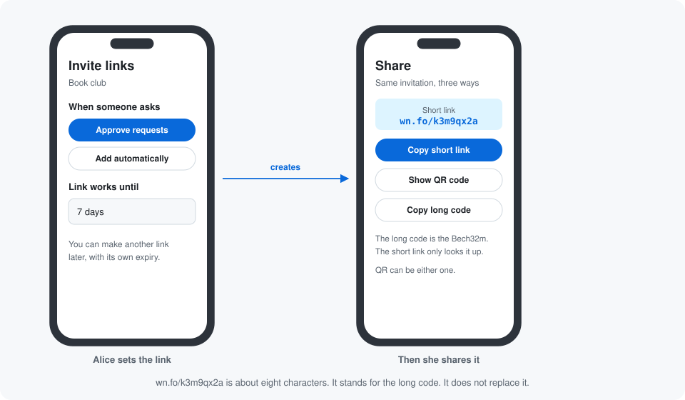
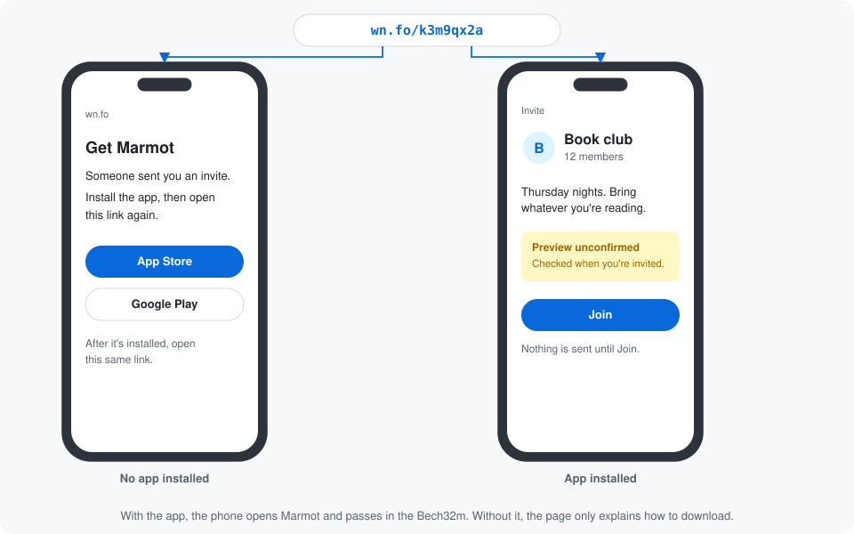
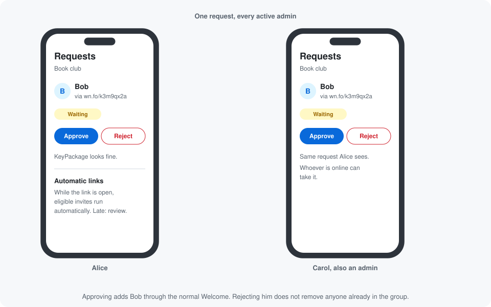
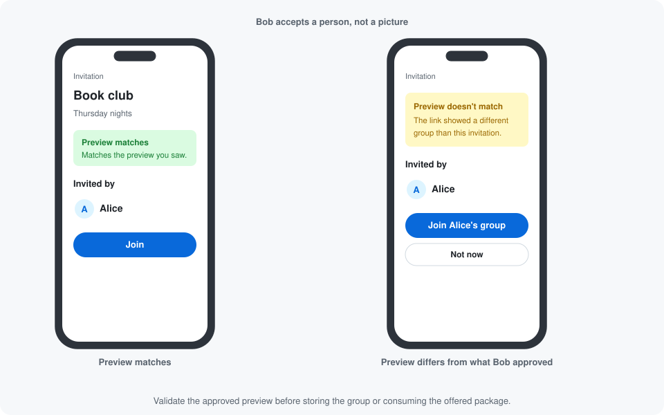
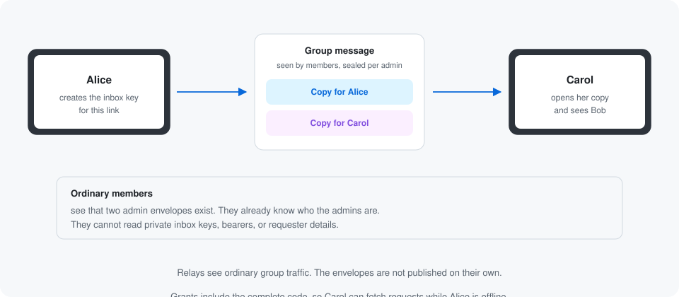
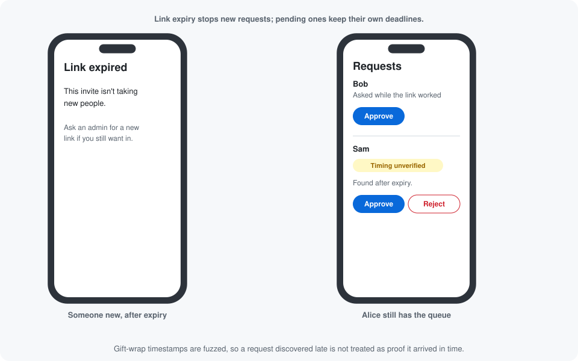

# Group invite links

Status: non-normative walkthrough of a proposed specification. Nothing here changes adopted Marmot conformance.
The complete draft lives in [the feature](../features/group-invite-links.md),
[component](../app-components/group-invite-links-v1.md), [records](../foundation/invite-link-records.md), and
[Nostr extension](../transports/nostr-invite-links.md). Those documents own the rules and bytes.

Alice wants to share Book club without being online when Bob opens it. Bob sees a preview, chooses Join, and waits
for an admin to invite his device through Marmot's normal Welcome flow. Carol can handle the request too.

## At a glance

- The complete invitation is a code. A short URL or QR delivers that code to the app.
- Opening the preview sends no request. Bob chooses Join before sharing his account and offered device with admins.
- The bearer authorizes a request. Bob's device signing key proves consent. An authorized MLS Add creates membership.
- Every current admin can handle requests once they have the private material. No coordinator chooses membership.
- Link expiry stops automatic admission. Pending requests have their own deadlines and can still be reviewed manually.
- An inviter receipt means Invited. Bob's validated, associated Welcome means Joined.
- The preview remains unconfirmed until checked against the Welcome. A match does not independently authenticate the
  group: Bob still trusts the inviter shown by the app.

## Scene 1: Alice shares a link

Alice chooses manual approval or automatic admission, then an expiry. Her app creates independent inbox and preview
keys and a bearer, and commits the preview and policy to group state before sharing. Changing those choices creates
a new invitation generation. Nobody can silently change the semantics of a copied code.

The share sheet offers the complete code, its QR, and optionally a short URL. The proposed code is Bech32m with the
`marmot` prefix; it carries the encrypted preview's location, its decryption key and the bearer. The bounded picture
is inside the encrypted preview, so the code needs no separate image key or image URL.

`wn.fo/k3m9qx2a` illustrates a deployment's short URL, not a protocol role or prescribed hostname. That host stores the
complete code and can read its secrets. A direct code or QR avoids that host. A direct HTTPS fragment can carry the
code without putting it in the HTTP request, but page scripts can still read it.

A short-link page can offer installation instructions and a generic unfurl. If the app is installed, the same link
opens the preview. Deleting a short URL only breaks that lookup; revoking the generation in group state retires the
actual invitation. Short-link alphabet, lifetime and abuse controls remain deployment choices.

## Scene 2: Bob opens it and asks

Bob first sees the name, description and picture, marked unconfirmed. Fetching the encrypted descriptor shares network
metadata with relays, but sends no account-bearing join request. The app renders plain text and bounded images without
following URLs in the preview.

When Bob chooses Join, his device offers one exact published KeyPackage and signs consent with that package's MLS
leaf signing key. Its existing account identity proof binds the leaf to his account. Those are separate proofs:
account authorization alone does not show that this particular device asked to join.

The request is gift-wrapped to the invitation inbox and retained before sending. It has an immutable device context
and deadline. A retry keeps the same request; a fresh request is a fresh user choice. Two devices of Bob's account can
ask independently, with different contexts and packages.

A package refresh follows a signed chain from the original consent key, even if the new package has another leaf key.
A missing ancestor is a recovery problem. A competing refresh stops automatic processing. Losing the original consent
key requires a new request rather than pretending account equality proves device continuity.

## Scene 3: Any current admin handles it

Alice and Carol can each fetch the encrypted request. They validate its bearer, account binding, originating-device
consent, offered package and current policy. A lock-screen alert can say a request is waiting without naming Bob.
A missing package or expired deadline gets a recoverable explanation rather than a false success.

Manual mode waits for an admin choice. Automatic mode uses the same validation and only acts while the link and
request are valid, with no observed withdrawal, decline or conflicting refresh. A current admin can manually reconsider
a decline; a withdrawal needs new consent.

Alice and Carol can act at the same time. Their messages do not elect a leader or pick an MLS branch. Marmot's existing
Commit validation, publish-before-apply and convergence determine whether Bob's exact leaf was added. A losing or
uncertain Add is reconciled before preparing another; failed Welcome or status delivery retries the saved bytes.
A decline or withdrawal does not remove someone already added on the selected branch.

## Scene 4: Bob gets the Welcome

After the Add succeeds, Alice sends the ordinary Welcome plus an encrypted status that ties this request revision to
that exact Commit and Welcome. It names Alice through her account seal, not merely the shared inbox key.

Bob processes the Welcome through Marmot's existing tentative join checks. Request association also checks the exact
offered package, the status's Welcome hash, the inviter identity and the preview commitment in the resulting group.
A missing status leaves an ordinary invitation unassociated; it does not invalidate or delay an otherwise valid Welcome.

The app compares the preview Bob actually approved, not a newly fetched replacement. A mismatch asks for a fresh
choice. Another Welcome does not close this request. The row becomes Joined only after validation and association.

A malicious inviter can copy the link commitments into another group. The comparison therefore detects substitution
of the preview, not independent authenticity of Book club. The app shows who authored the Welcome, preserving
[Marmot's first-contact trust limit](../protocol-core/joining.md#welcome-bootstrap-trust).

## Scene 5: Carol catches up privately

Every member receives ordinary group traffic. Alice therefore encrypts private grants, forwarded requests and decisions
again for each current admin, with Nostr gift wraps and signed account seals inside an unsigned Marmot app event.
Ordinary members can see the admin recipient accounts, but cannot read private keys, bearers or requester records.
The enclosing MLS sender and source-epoch policy authenticate the admin action; the nested seal alone is insufficient.

Carol can recover from retained group traffic or a current admin's fresh copy. A new admin or another device already
in the group gets a fresh grant. If nobody retains the material, the group creates a new generation. The app does not
claim every lost request can be recovered from relays.

Reading or forwarding a request does not delete it. Decisions remain recoverable through restart, with bounded
retention and capacity. Full capacity pauses new admission rather than evicting records needed to prevent duplicate
Adds. An uncertain publication keeps its ordinary durability obligation even after the request expires.

Removing an admin rotates all active invitation generations in the same policy Commit. Old ciphertext stays readable
by anyone who retained its key; rotation protects requests sent using the new codes. Someone opening an old code can
still disclose their identity to an old inbox-key holder. Existing members already know the public component
state, including inbox addresses. Private grant bytes stay inside the recipient encryption.

## Scene 6: Expiry and retirement

Link expiry stops new normal requests and automatic admission. A pending request remains manually reviewable until
its own signed deadline. A request first discovered after expiry is timing-unverified: randomized gift-wrap timestamps
cannot prove the device asked before the link expired.

Revocation or security-driven retirement cancels all unfulfilled requests for that generation. Withdrawal closes one
device context. None of these removes an existing member. Disbanding uses Marmot's adopted terminal lifecycle and
stops all request processing.

A delayed Welcome may become unusable after ordinary KeyPackage private-key deletion. Invited never promises Joined,
and the feature does not prolong private initialization-key retention. The admin reconciles membership before a new
explicit join attempt, preserving existing removal/rejoin safeguards.

## Privacy and deployment questions

The inbox is a random invitation address, separate from account identity and group delivery. Relays still see sizes,
timing and recipient addresses. Publishing a package near the request can correlate activity. Joining is not anonymous.
Signed admin seals can be disclosed outside the group. A leaked bearer permits requests; a leaked inbox key exposes
old encrypted requests; leaking both does not authorize an Add or a group-policy change.

The complete draft settles request bytes, consent/refresh, status correlation, private admin delivery, revocation and
retention. Remaining deployment questions are short-link hosting and enumeration protection, external-signer UX for
account seals, and clock-skew handling within the draft's explicit local expiry gates. The fixed limits and proposed
allocations still require adoption and interoperability testing before production use.
